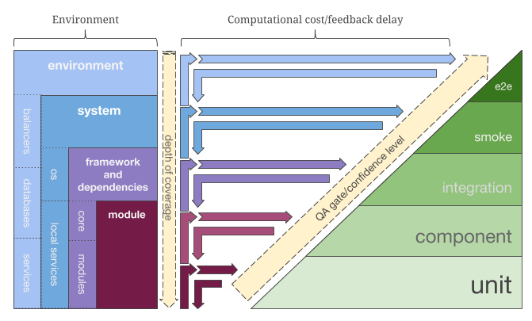
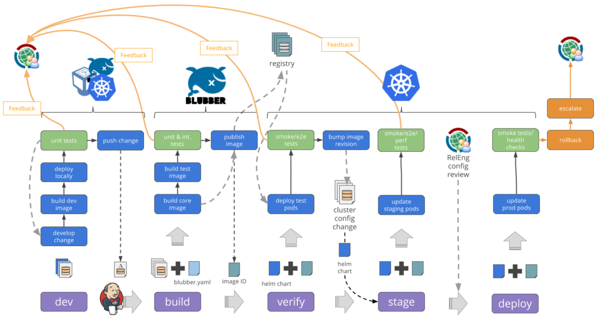
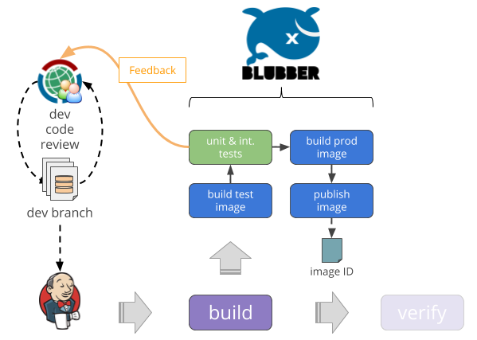
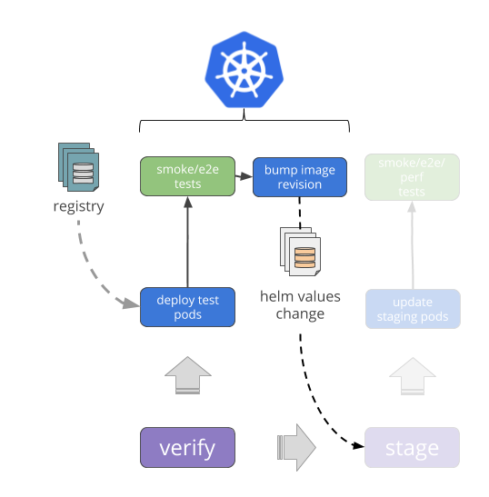

# Streamlined Service Delivery
## Wikimedia's Continuous Delivery Pipeline

<!-- NOTE: Describe the stages, briefly -->

# Why the pipeline

* Developer empowerment
* Environment parity
* Feedback cycles
* Reproducibility and deployment confidence

#


# What the pipeline

* Promotion of application images
* Immutable progression
* Testing from the inside out

# 

#
## Image Building using Blubber

* Docker wrapper
* Efficiency
* Security
* Empowerment

# 


# Blubber – Efficiency
* Dockerfiles are... idiomatic? Blubber uses declarative YAML
* Blubber knows how to write cacheable instructions
* Supports multi-stage builds (smaller resulting images)

# Blubber – Security
* Enforces a security model
    * `root`: Install system packages, etc.
    * `somebody`: Owns app files, installs dependencies (e.g. npm), etc.
    * `runuser`: Runs application entry-point

<!-- NOTE: Why does this matter? container exit exploits require root; allowing runtime processes to modify app files is dumb, even in a container. -->

# Blubber – Empowerment
* _Developers_ specify system dependencies, package managers, entrypoints in their repos
* _Developers_ define their tests in their repo
* _Developers_ deploy (eventually)

# Developers, Developers, Developers
# 

# 

`blubber.yaml`

```{.yaml}
    base: docker-registry.wikimedia.org/nodejs-slim
    apt: { packages: [librsvg2-2] }

    variants:
      build:
        base: docker-registry.wikimedia.org/nodejs-devel
        apt: { packages: [librsvg2-dev, git, build-essential] }
        node: { requirements: [package.json, package-lock.json] }
      test:
        includes: [build]
        entrypoint: [npm, test]
      production:
        copies: build
        node: { env: production }
        entrypoint: [node, server.js]
```

# Blubber
## Variants – Why?

* Parity (development -> testing -> production)
* But some things are simply different in dev/testing
* A balance is struck by _selectively_ overriding

# Blubber
## Variants – How?

```{.yaml}
    base: docker-registry.wikimedia.org/nodejs-slim
    apt: { packages: [librsvg2-2] }

    variants:
      build:
        base: docker-registry.wikimedia.org/nodejs-devel
        apt: { packages: [librsvg2-dev, git, build-essential] }
        node: { requirements: [package.json, package-lock.json] }
```

<!--
* Base image and entrypoint
-->

# Blubber
## Variants – How?

```{.yaml}
    variants:
      build:
          # ...
      test:
        includes: [build]
        entrypoint: [npm, test]
      prep:
        includes: [build]
        node: { env: production }
```

<!--
* Can inherit from other variants
-->

# Blubber
## Variants – How?

```{.yaml}
    variants:
      # ...
      prep:
        includes: [build]
        node: { env: production }
      production:
        copies: prep
        node: { env: production }
        entrypoint: [node, server.js]
```

<!--
* Copies `copies` in compiled packages from other images
-->

# Image Built
## Now what?

# Jenkins Pipeline


# 
## Jenkins Pipeline Steps

1. Checkout patch from zuul and build test variant
2. Run test variant
3. Build production variant
4. Deploy production variant to minikube in CI
5. Helm test
	* service-checker-swagger in a separate pod
	* verifies endpoints in deployed application pod
6. Push production image to the registry

# 
## Jenkins Pipeline Steps

1. Checkout patch from zuul and build test variant
2. Build test variant and run entry point
3. Build production variant
4. **Deploy production variant to minikube in CI**
5. **Helm test**
	* **service-checker-swagger in a separate pod**
	* **verifies endpoints in deployed application pod**
6. Push production image to the registry

# 


#
## Docker Production Registry
* [docker-registry.wikimedia.org](https://docker-registry.wikimedia.org/v2/_catalog)
* Mathoid image currently running in production:

```
docker-registry.wikimedia.org/
wikimedia/mediawiki-services-mathoid:build-44
```

# 
## Helm
* Glues together configuration and containers
* Manages deployments as a unit
* Chart repo: [releases.wikimedia.org/charts/](https://releases.wikimedia.org/charts/)

# Deployment to production

```helm upgrade```

#
### Slides available at
```
people.wikimedia.org/~thcipriani/pipeline
```
### Blubber available at
```
people.wikimedia.org/~thcipriani/blubber
```


